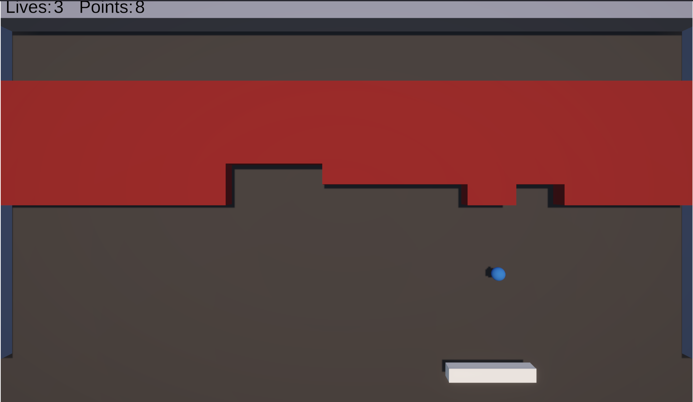
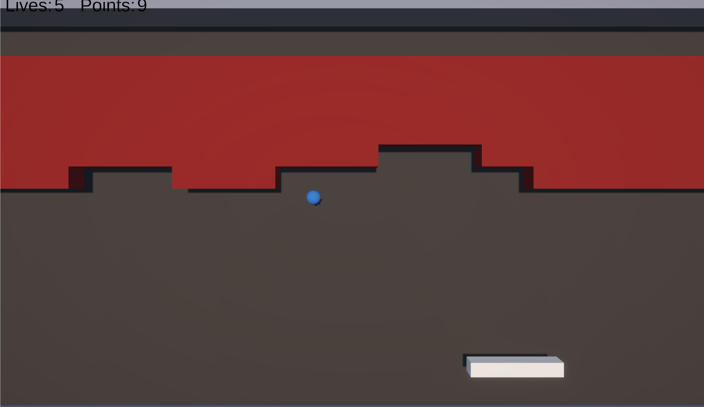

# Breakout Reflection
## Breakout-1
The goal of breakout version 1 was to create something that resembled the game of breakout in basic function. These goals included a ball that bounces, bricks that break, and a paddle that moves. While these are very low standards, they are the foundations upon which everything else is built. 

In the making of this version I reaquainted myself with the basics of unity. I learned how to destroy gameobjects, lock movement onto certain axes, and create gameobjects at runtime with an array. More broadly I learned the true scope of even a "simple" game like breakout and how many variables there are that one can tune to totally change the way the game plays. Variables include: brick size and spacing, ball speed, paddle size and speed, ball bounce angle, width of playing field, and many more. 

From my playtesters I learned mostly about a lot of small issues. The way the paddle movement felt and the speed of the ball, for example. Mostly though the changes I would make for version 2 were from my own observations.

[Play breakout version 1](https://cc3265a.github.io/game-dev-spring2025/builds/breakout-1/)

## Breakout-2
The goal of version 2 was to fix the errors that had been previously identified, as well as something that could (generously) be called levels. I am relatively sure that in the course of making this version I acccidentally saved over version 1, making the two nigh identical. I added points and a very simple UI to keep track of them and lives. I added the capacity for "levels" in which upon each new level the number of bricks would decrease. I initially, and indeed sank a good few hours into, trying to make several different types of bricks which would gradually increase the speed of the ball as in the original version of breakout. However I ran into issues with the speed increasing too quickly and becoming unplayable, or the ball not moving at all. In retrospect I think I could have resolved these with not much more work than I had already done, but instead I tossed the idea to instead make the decreasing number of bricks up to "level" 5. 

Mostly with this version I learned patience. Its a lesson I've learned many times with coding and I'll learn it many more. I learned that the small details of breakout come together to create a much more fun version of the game than a version without the invisible details. I reviewed how to create and use tags to change the behavior upon collisions. 

This time I seem to have deleted the notes I made about the comments from playtesters. The biggest one, though, was that the ball could get stuck going back and forth with very little or no vertical movement, which was boring at best, and a softlock at worst. I also admitted to myself that my levels were bad, and I needed a gimmick for the game. 
[Play breakout version 2](https://cc3265a.github.io/game-dev-spring2025/builds/breakout-2/)

